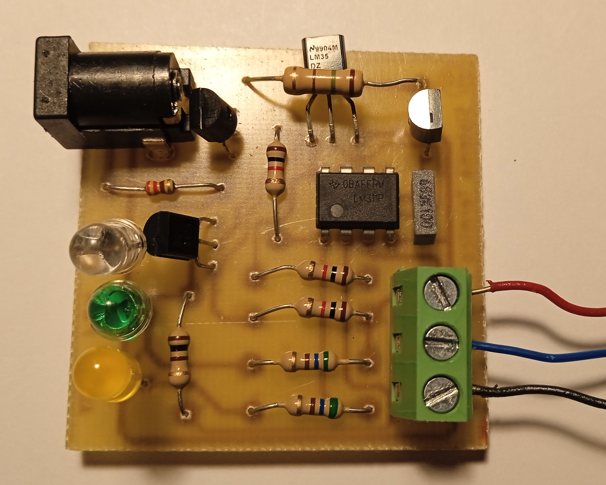
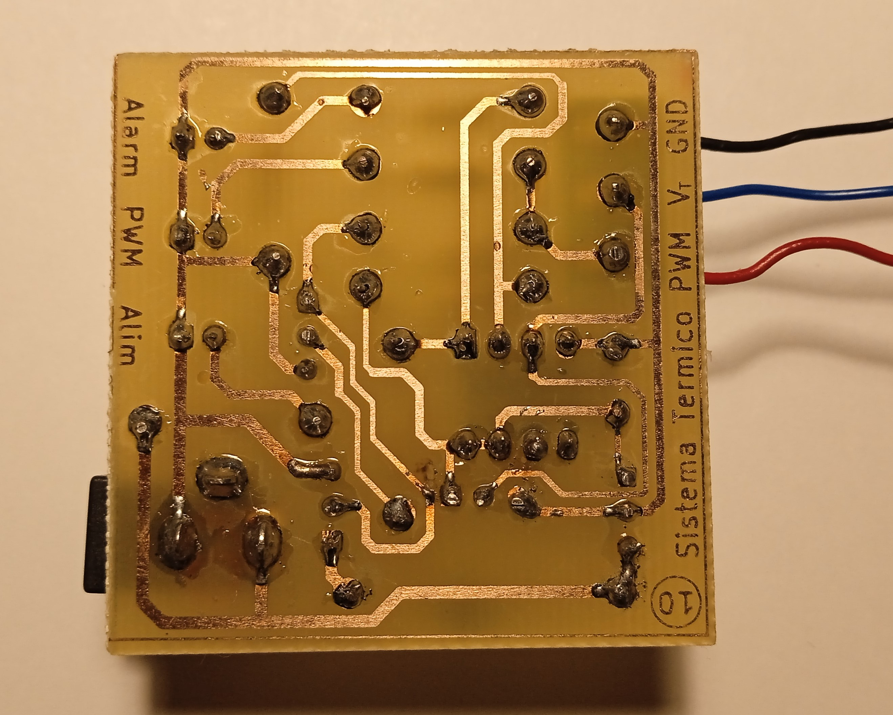
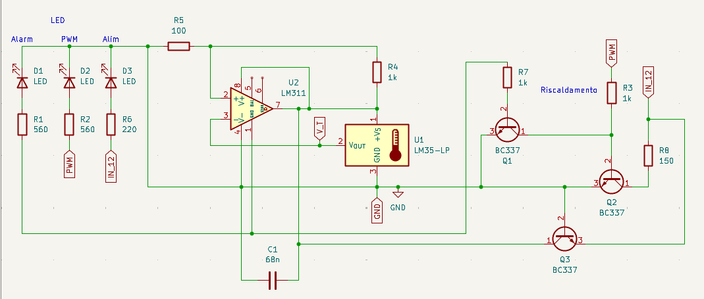
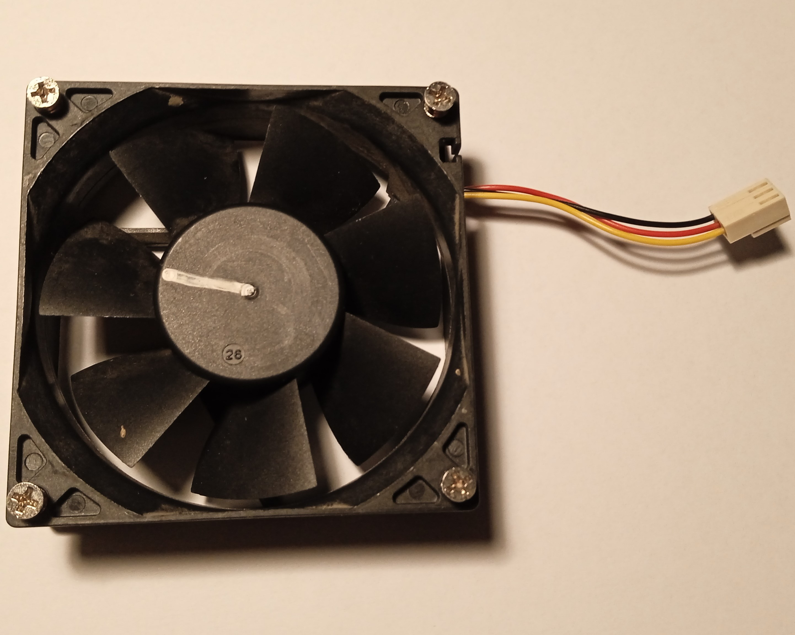
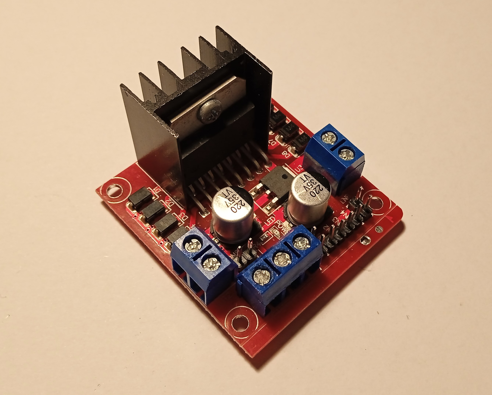
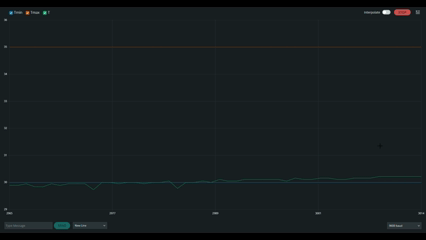

# 💻 Thermal_Shield 🌡️

Un progetto Arduino per il controllo della temperatura tramite una scheda termica e una ventola. 
 

## 🧾 Materiali necessari:
- Arduino UNO
- Scheda termica
- Ventola 12 V
- Ponte H

## 🌡️ Scheda termica:
La scheda termica utilizzata nel nostro sistema è stata realizzata dalla nostra scuola, [Istituto Max Planck (Villorba, TV)](https://maxplanck.edu.it).

### 📐 Struttura:
La scheda termica è strutturata su un PCB e si presenta come riportato nelle seguenti immagini.
 

  
  

### 🖇️ Schema
Di seguito è riportato lo schema elettrico della scheda.  

[Progetto Kicad](./Thermal_Shield/Thermal_Shield.kicad_pro)

### 🔌 Collegamenti:

- Alimentare la scheda (jack DC) ad una tensione di 12 V
- Collegare Arduino UNO tramite la morsettiera:
    - GND → GND
    - $V_T$ → Ingresso Analogico di Arduino (A0 - A5)
    - PWM → Uscita PWM di Arduino (pin 3, 5, 6, 9, 10 o 11)

## 💨 Ventola:
Generica ventola 12 V (es. ventola da PC).  

### 🔌 Collegamenti:
- Power → alimentazione 12 V (tramite [ponte H](#ponte-h))
- GND → GND (comune tra Arduino e alimentazione 12 V)
- RPM → Pin interrupt di Arudino (2, 3)

⚠️ **Non collegare GND all'uscita del ponte H, altrimenti l'encoder non funziona correttamente**.  
❗ Nel codice allegato non è presente la misurazione della velocità (RPM) ma è facilmente integrabile.

❗ Collegare 5 V del ponte H a $V_{in}$ di Arduino se si vuole far funzionare il sistema indipendente dall'alimentazione USB.  
⚠️ In questo caso, **alimentare il ponte H prima di collegare Arduino con USB** per evitare problemi di alimentazione.
  

### 🔌 Ponte H:
È possibile usare un qualsiasi ponte H.  
Nel mio caso ho utilizzato un L298N, utilizzando esclusivamente il "ramo" B.   

Collegare il pin IN3 (se si utilizza il "ramo" B) ad un'uscita PWM di Arduino (pin 3, 5, 6, 9, 10 o 11).  
⚠️ Si può verificare se il l'alimentazione ha polarizzazione corretta cortocircuitando il pin IN3 con i 5 V di Arduino: se la ventola inizia a girare il pin è corretto, altrimenti collegare il pin IN4 (o il complementare della coppia del "ramo" scelto).

#### ❗ Alternative:
Se non si dispone di un ponte H è possibile sostituirlo con un circuito a transistor con dovuto dimensionamento.
 

### ⚙️ Filtro segnale PWM:
Poiché il segnale PWM potrebbe non essere propriamente adatto alla tua ventola è consigliabile realizzare un filtro RC come quello di seguito riportato.  
...

## 🛠️ Setup:
1) Effettuare i collegamenti sopra descritti
2) Adattare i pin impostati nel [codice allegato](/Thermal_Shield.ino) sulla base delle proprie necessità
3) Impostare i propri valori di T_min e T_max
4) Se necessario, modificare il kp e q (nella funzione FTU) affinché la ventola riesca ad abbassare la temperatura fino a T_min
5) Caricare il [codice allegato](/Thermal_Shield.ino) e aggiornato (vedi punto 2) su Arduino tramite Arduino IDE

## 💻 Utilizzo:

### 🟢 Azionamento:
Si può azionare il sistema tramite:
1) Pressione del pulsante Start
2) Scrittura '1' su Seriale

A seguito di una delle 2 azioni il sistema inizierà il suo ciclo di riscaldamento/raffreddamento.

### 🔴 Spegnimento:
Si può fermare il sistema tramite:
1) Pressione del pulsante Stop
2) Scrittura '0' su Seriale

A seguito di una delle 2 azioni il sistema si fermerà togliendo alimentazione a resistenza riscaldante e ventola (non svolge però la funzione di freno alla ventola, che continuerà a ruotare per inerzia).

### 📊 Misurazione / rappresentazione grafica:
È possibile osservare il variare della temperatura tramite la lettura della comunicazione seriale. In particolare:
- **Monitor Seriale**: Permette una facile lettura dei dati "grezzi" 📄
- **Plotter Seriale**: Permette una facile visualizzazione grafica del variare dei valori 📉

 

